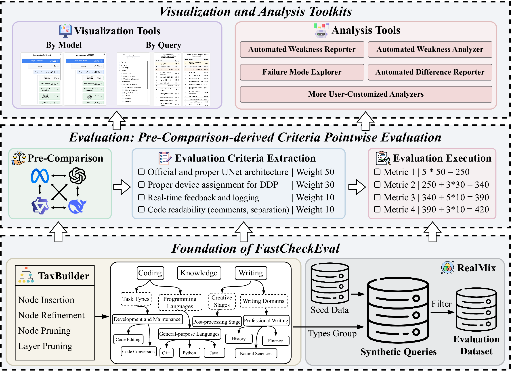

# Feedbacker

[](https://arxiv.org/abs/2505.06698)



This is the official code of paper "Feedbacker: Fast Checking LLMs’ Weaknesses with Comprehensive and Fine-Grained Evaluation".

# 📖 Introduction

Feedbacker is a novel evaluation tool that differs from existing automatic evaluation benchmarks. Instead of just providing an overall score for you to claim that your model is "stronger," its primary function is to help you quickly identify your model's weaknesses in specific query categories. Of course, it can also help you identify strengths. 

Here are a few examples to help you quickly understand Feedbacker: for instance, if your model performs poorly in handling XML language, or if your model excels in writing business reports, Feedbacker can highlight these specific strengths and weaknesses. 

Feedbacker operates under four components:  
1. **TaxBuilder**: An extensible builder that can automatically construct a taxonomy of queries.  
2. **RealMix**: A technique for synthesizing new queries, with an emphasis on generating queries that are truly encountered in real-world scenarios.  
3. **Evaluation**: We developed a new evaluation technique called **Pre-Comparison-Derived Criteria Pointwise Evaluation**, which achieves the accuracy of pairwise evaluation with the efficiency of pointwise evaluation.  
4. **Visualization and Analysis**: We developed various tools to assist users in analyzing their models.

Below, we will demonstrate how to use Feedbacker to quickly identify your model's weaknesses in specific query categories, as well as strengths. 

##  ⬇️ Preparation

### Environment Installation

```bash
conda create -n Feedbacker python=3.12
conda activate Feedbacker
git clone https://github.com/liudan193/Feedbacker.git
cd Feedbacker
pip install -r requirements.txt
```

### Dataset Download

You can download the dataset feedbacker_data.zip using the following command and extract it to the corresponding directory. 

```bash
huggingface-cli download DanliuDanliu/Feedbacker --local-dir ./download/ --repo-type dataset
```

If the download link is unavailable, please visit our [Hugging Face Page](https://huggingface.co/datasets/DanliuDanliu/Feedbacker) and download `feedbacker_data.zip`. 

After downloading, organize the file into the corresponding directory:

```bash
Feedbacker/
├── evaluation/
│   ├── data/
│   │   ├── evaluation_dataset_v0.1.jsonl                # The evaluation dataset without criteria and baseline answer (Feedbacker-D-V0 in our paper)
│   │   └── human_preference_dataset.jsonl               # The human preference data (Feedbacker-HPD in our paper)
│   └── outputs/
│       ├── evaluation/                                  # Model evaluation results
│       │   ├── deepseek-v3-250324.jsonl
│       │   ├── deepseek-r1-250120.jsonl
│       │   └── ...
│       ├── generation/                                  # Model-generated outputs
│       │   ├── deepseek-v3-250324.jsonl
│       │   ├── deepseek-r1-250120.jsonl
│       │   └── ...
│       ├── data_for_ours_eval_baseline.jsonl            # The evaluation dataset with criteria and baseline answer (**We recommend using this dataset as evaluation data.**)
│       ├── ours_get_criteria.jsonl                      # Criteria used for our evaluation
│       └── ours_ques2ans_3.jsonl                        # Final answer generation results
└── query_synthesis/
    └── dataset/
        └── seed_data.jsonl   
```

## 🌲 1 Taxonomy Preparation

You can choose to use the taxonomy we provide. See: [visualization_and_analysis/cata_tree.json](visualization_and_analysis/cata_tree.json).

(Optional) You can also choose to customize your own taxonomy since Feedbacker is highly extensible. Guidelines for building your customized taxonomy tree can be found in: [Build Customized Taxonomy Tree](taxonomy).

## 🎁 2 Dataset Preparation

You can choose to use the evaluation dataset we provide. See: [evaluation/data/evaluation_dataset_v0.1.jsonl](evaluation/data/evaluation_dataset_v0.1.jsonl).

If you want to use the criteria and baseline model we provide, you can directly use the criteria we generated. See: [evaluation/outputs/data_for_ours_eval_baseline.jsonl](evaluation/outputs/data_for_ours_eval_baseline.jsonl).

(Optional) You can also create your own custom evaluation dataset using our RealMix. Guidelines for building your customized evaluation dataset can be found in: [Generate New Queries](query_synthesis).

## 🎯 3 Evaluation

If you simply want to test our Visualization and Analysis Toolkits, you can directly use the generation and evaluation results we provided in [evaluation/outputs](evaluation/outputs).

### 🧩 3.1 Model Service Preparation

When you reach this step, we first recommend preparing several models:

1. **Model to be evaluated**: The model you want to evaluate.
2. **(Optional) Model for pre-comparison**: Our evaluation method requires several models to generate their responses to assist in extracting more effective evaluation criteria. This can be any model. We adopt gpt-4o-2024-11-20, deepseek-v3-250324, and doubao-1-5-pro-32k-250115 in our paper. (If you're using the criteria we generated, you do not need to prepare this model.)
3. **(Optional) Baseline model**: The model that serves as the baseline in the evaluation. Our evaluation results are relative to its performance. We adopt gpt-4o-2024-11-20 in our paper. (If you're using the baseline model we use, you do not need to prepare this model.)
4. **Evaluation model**: This model is used to generate criteria and evaluate other models. We recommend using more advanced models, especially reasoning models. We adopt QwQ-32B in our paper and we also highly recommand DeepSeek-R1. 

Note that you need to prepare your models in OpenAI-compatible format. Evaluation requires three things: model name, base url, and API key. If you're unsure how to prepare, please refer to: [All-to-OpenAI-Compatible-API](https://github.com/liudan193/All-to-OpenAI-Compatible-API). 

### 🚀 3.2 Execute the Evaluation

After you have prepared these services, you can follow the guidance in [Evaluate Models](evaluation) to perform the evaluation. 

## 📊 4 Visualization and Analysis Toolkits

1. Place the evaluation results obtained from the previous step into the `visualization_and_analysis/evaluation_source_data` directory.
2. Enter the directory: `cd ./visualization_and_analysis`
3. Run the following command to process the data obtained above.
```bash
python source_result_processing.py
```
4. Run the following command to get the analysis results.
```bash
python auto_analysing.py
```
5. Then, you can run the visualization and analysis tools locally.
```bash
python -m http.server 8103
```

For more details, refer to: [Visualization and Analysis](visualization_and_analysis).

## 🏷️ Citation

If Feedbacker is useful for your research, please consider citing the following paper: 

```bibtex
@article{wang2025fromrankings,
    title={From Rankings to Insights: Evaluation Should Shift Focus from Leaderboard to Feedback},
    author={Wang, Zongqi and Gu, Tianle and Gong, Chen and Tian, Xin and Bao, Siqi and Yang, Yujiu},
    journal={arXiv preprint arXiv:2505.06698},
    year={2025}
}
```